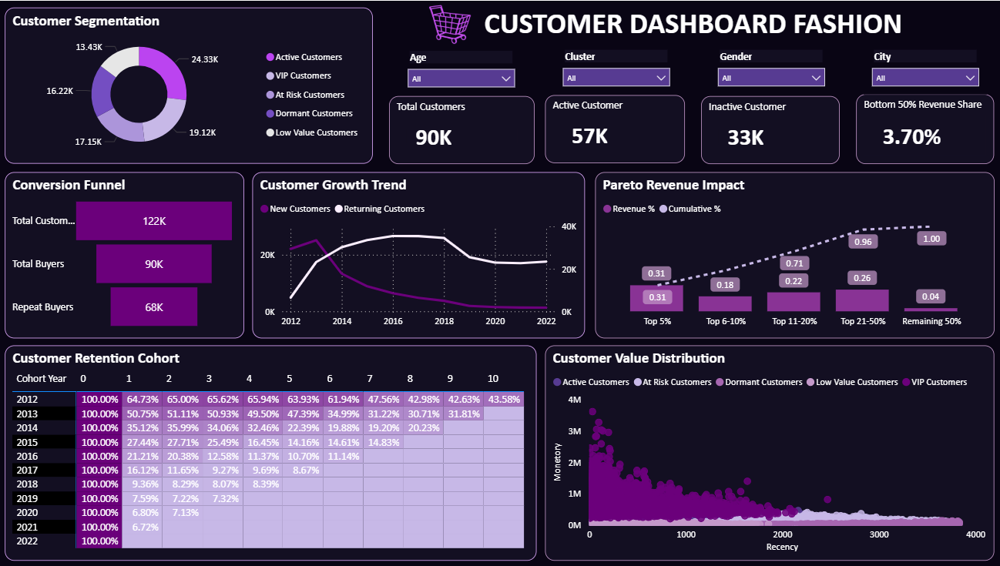
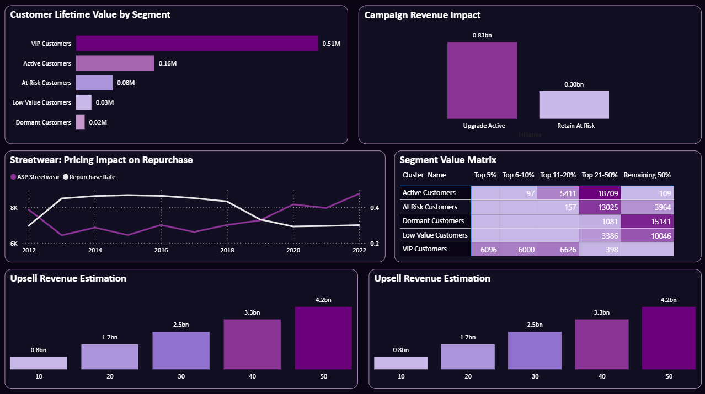

# Dự Báo Doanh Thu - Thương Mại Điện Tử Thời Trang

**Báo cáo kiến tập**
**Nguồn dữ liệu:** Datathon 2026 – The Gridbreakers

---

# Mô tả bài toán

Doanh nghiệp thương mại điện tử thời trang tại Việt Nam cần dự báo doanh thu (Revenue) nhằm tối ưu tồn kho, lập kế hoạch khuyến mãi và vận hành logistics.

| Thành phần      | Mô tả                                             |
| --------------- | ------------------------------------------------- |
| Train           | `sales.csv` – Từ 07/04/2012 đến 31/12/2020        |
| Test            | `sales_test.csv` – Từ 01/01/2021 đến 31/12/2022   |
| Chỉ số đánh giá | MAE, RMSE, R², Adjusted R²                        |
| Phạm vi dữ liệu | 4 danh mục sản phẩm · 3 khu vực · 90K+ khách hàng |

---

# Cấu trúc dự án

```text
revenue-forecast-ecommerce/
├── data/
│   ├── raw/
│   │   ├── master/       # products, customers, promotions, geography
│   │   ├── transaction/  # orders, order_items, payments, shipments, returns, reviews
│   │   ├── analytical/   # sales, sales_test, sample_submission
│   │   └── operational/  # inventory, web_traffic
│   └── processed/
│       ├── cleaned/      # Data sau làm sạch
│       └── features/     # Feature table cho modeling
├── notebooks/
│   ├── 01_data_overview.ipynb
│   ├── 02_data_cleaning.ipynb
│   ├── 03_eda_master.ipynb
│   ├── 04_eda_operations.ipynb
│   ├── 05_business_analysis.ipynb
│   ├── 06_time_series_decomposition.ipynb
│   └── 07_modeling.ipynb
├── src/
│   ├── data_loader.py
│   ├── preprocessing.py
│   ├── feature_engineering.py
│   ├── evaluation.py
│   └── plot_utils.py
├── outputs/
│   └── figures/          # Biểu đồ export (PNG)
├── reports/
│   └── powerbi/          # File .pbix dashboards
├── requirements.txt
└── README.md
```

---

# Hướng dẫn chạy

```bash
# 1. Cài đặt thư viện
pip install -r requirements.txt

# 2. Chạy notebooks theo thứ tự
jupyter notebook
```

---

# Quy trình phân tích (CRISP-DM)

| Giai đoạn                 | Notebook | Nội dung                                   |
| ------------------------- | -------- | ------------------------------------------ |
| Hiểu dữ liệu              | 01       | Tổng quan 15 bảng dữ liệu, từ điển dữ liệu |
| Chuẩn bị dữ liệu          | 02       | Xử lý giá trị thiếu, chuẩn hóa dữ liệu     |
| EDA – Master Data         | 03       | Sản phẩm, khách hàng, khuyến mãi           |
| EDA – Operations          | 04       | Tồn kho, vận chuyển, hoàn trả, đánh giá    |
| Phân tích kinh doanh      | 05       | KPI, doanh thu, câu hỏi kinh doanh         |
| Time Series Decomposition | 06       | STL decomposition, seasonality             |
| Modeling                  | 07       | Huấn luyện, đánh giá và so sánh mô hình    |

---

# Kết quả phân tích

## 1. Khám phá dữ liệu (EDA)

Phân tích toàn bộ pipeline dữ liệu từ sản phẩm đến khách hàng đã phát hiện 5 nhóm insight cốt lõi ảnh hưởng trực tiếp đến doanh thu.

### Insight 1 — Doanh thu có tính mùa vụ nhưng suy giảm từ năm 2019

Doanh thu đạt đỉnh vào giai đoạn tháng 4–6 hằng năm và duy trì chu kỳ ổn định trong giai đoạn 2012–2018. Tuy nhiên từ năm 2019, doanh thu giảm mạnh và không phục hồi về mức cũ mặc dù lượng truy cập website vẫn tăng.

Theo công thức:

> Revenue = Sessions × Conversion Rate × Average Order Value

Conversion Rate giảm hơn 60% được xác định là nguyên nhân chính thay vì thiếu lưu lượng truy cập.

**Hàm ý cho mô hình dự báo:** cần đưa Conversion Rate và Average Order Value vào tập feature thay vì chỉ sử dụng Sessions.

---

### Insight 2 — Streetwear tạo phần lớn doanh thu nhưng hiệu quả đang suy giảm

Streetwear tạo ra 13,1/16,43 tỷ đồng tổng doanh thu nhưng biên lợi nhuận chỉ đạt 9,55%, thấp nhất trong 4 danh mục.

Tỷ lệ đơn hàng trên mỗi phiên giảm từ:

* 0,60% (2013–2016)
* xuống còn 0,21% (2020–2022)

Xu hướng này trùng với giai đoạn giá bán trung bình của Streetwear tăng mạnh.

#### BCG Portfolio Matrix

| Danh mục   | Tăng trưởng YoY | Biên lợi nhuận | Vị trí BCG    |
| ---------- | --------------- | -------------- | ------------- |
| GenZ       | +26,6%          | 20,16%         | Star          |
| Casual     | +37,9%          | 10,51%         | Question Mark |
| Streetwear | +8,1%           | 9,55%          | Dog           |
| Outdoor    | +4,4%           | 13,90%         | Dog           |

**Hàm ý cho mô hình dự báo:** cần xây dựng feature xu hướng riêng cho từng danh mục.

---

### Insight 3 — Cơ chế khóa màu theo size gây thất thoát doanh thu kép

Phân tích heatmap Size × Color cho thấy doanh nghiệp áp dụng cơ chế cứng:

* Size S và L chỉ bán một nhóm màu.
* Size M và XL chỉ bán nhóm màu còn lại.

Hệ quả:

1. Khách hàng không tìm được tổ hợp mong muốn → giảm Conversion Rate.
2. Khách chọn size gần đúng → tăng tỷ lệ trả hàng Wrong Size.

Wrong Size chiếm khoảng 35% tổng số đơn hoàn trả ở tất cả các danh mục và tạo ra khoảng 943 triệu đồng doanh thu ảo (6,02% tổng doanh thu).

---

### Insight 4 — Tồn kho mất cân đối gây thiệt hại doanh thu

Tỷ lệ hết hàng cao ở tất cả các danh mục:

| Danh mục   | Tỷ lệ Out-of-Stock |
| ---------- | ------------------ |
| GenZ       | 68,29%             |
| Casual     | ~66%               |
| Streetwear | ~67%               |
| Outdoor    | ~68%               |

Đồng thời tồn tại:

* 341 SKU tồn kho quá mức.
* Nhiều SKU khác liên tục hết hàng.

Doanh nghiệp đang rơi vào trạng thái:

> Thiếu hàng ở nơi cần bán nhưng dư hàng ở nơi không có nhu cầu.

Ước tính thiệt hại doanh thu khoảng 197,97 triệu đồng.

**Hàm ý cho mô hình dự báo:** tỷ lệ tồn kho và out-of-stock là nhóm feature có giá trị cao.

---

### Insight 5 — Khách hàng phân hóa mạnh theo CLV

Kết quả phân cụm RFM bằng K-Means (k = 5):

| Chỉ số      | Giá trị   |
| ----------- | --------- |
| CLV VIP     | ~510K VNĐ |
| CLV Dormant | ~20K VNĐ  |
| Chênh lệch  | ~25 lần   |

Ngoài ra:

* Top 5% khách hàng tạo ra 31% doanh thu.
* Top 20% khách hàng tạo ra 71% doanh thu.
* 33K/90K khách hàng (37%) đang ở trạng thái Dormant.

Retention Rate theo cohort:

| Cohort | Retention |
| ------ | --------- |
| 2012   | 64,73%    |
| 2017   | 16,12%    |

Xu hướng này trùng với giai đoạn Streetwear tăng giá.

---

## Tổng kết EDA — 3 nguyên nhân gốc rễ

| Cấp độ   | Nguyên nhân                                    | Tác động                   |
| -------- | ---------------------------------------------- | -------------------------- |
| Sản phẩm | Khóa màu theo size → Wrong Size Returns        | ~943 triệu đồng/năm        |
| Định giá | Streetwear tăng giá → Conversion Rate giảm 65% | Doanh thu giảm từ năm 2019 |
| Tồn kho  | Out-of-stock và Overstock đồng thời            | ~197 triệu đồng thất thoát |

---

# 2. Kết quả mô hình


### Prophet (Baseline)

* R² ≈ 0,29

Mô hình hóa tốt xu hướng và mùa vụ nhưng chưa nắm bắt được quan hệ phi tuyến phức tạp giữa các biến kinh doanh.

### Standalone Ensemble (CatBoost)

* R² ≈ 0,75

Hiệu suất tốt nhất nhờ tận dụng toàn bộ không gian đặc trưng và không bị giới hạn bởi cấu trúc chuỗi thời gian.

### Hybrid (Prophet + Ensemble)

Hiệu quả tốt hơn Prophet đơn thuần nhưng vẫn thấp hơn CatBoost độc lập do chỉ học trên phần residual sau khi Prophet đã tách trend và seasonality.

---

# 3. Business Intelligence Dashboard

Dashboard được xây dựng trên Power BI nhằm trực quan hóa toàn bộ bức tranh vận hành và hỗ trợ ra quyết định.

## Product Dashboard


Bao gồm:

* Doanh thu theo danh mục
* Tồn kho
* Tỷ lệ hoàn trả
* BCG Matrix
* Phân tích Size × Color

---

## Customer Dashboard




Bao gồm:

* Phân khúc RFM
* Cohort Retention
* Pareto Revenue
* CLV Analysis
* Revenue Opportunity Estimation

---

# 10 Câu Hỏi Kinh Doanh Trọng Tâm

| Dashboard | Câu hỏi                              | Insight chính                               |
| --------- | ------------------------------------ | ------------------------------------------- |
| Product   | Danh mục nào thiếu/thừa hàng?        | Streetwear hết hàng 49,55%; 341 SKU tồn kho |
| Product   | Size nào bán chạy nhất?              | Size M và L bán tốt nhất                    |
| Product   | Vì sao khách hoàn trả?               | Wrong Size chiếm khoảng 35%                 |
| Product   | Danh mục nào đáng đầu tư?            | GenZ là Star                                |
| Product   | Danh mục nào tăng trưởng nhanh nhất? | Casual tăng trưởng 37,9%                    |
| Customer  | Khách hàng thuộc phân khúc nào?      | 33K Dormant, 19K VIP                        |
| Customer  | Ai tạo doanh thu lớn nhất?           | Top 20% tạo 71% doanh thu                   |
| Customer  | Retention đang như thế nào?          | Cohort 2017 còn 16,12%                      |
| Customer  | Nên nâng cấp Active hay giữ At-Risk? | Active → VIP hiệu quả hơn                   |
| Customer  | Khu vực nào hiệu quả nhất?           | West có CLV cao nhất                        |

---

# Thành viên nhóm

| Thành viên       | Vai trò                                       |
| ---------------- | --------------------------------------------- |
| Lê Quang Huy     | EDA, Business Analysis, Dashboard Development |
| Nguyễn Tấn Trọng | Modeling, Feature Engineering, Evaluation     |

**Giảng viên hướng dẫn:** NCS.ThS Nguyễn Quang Phúc
