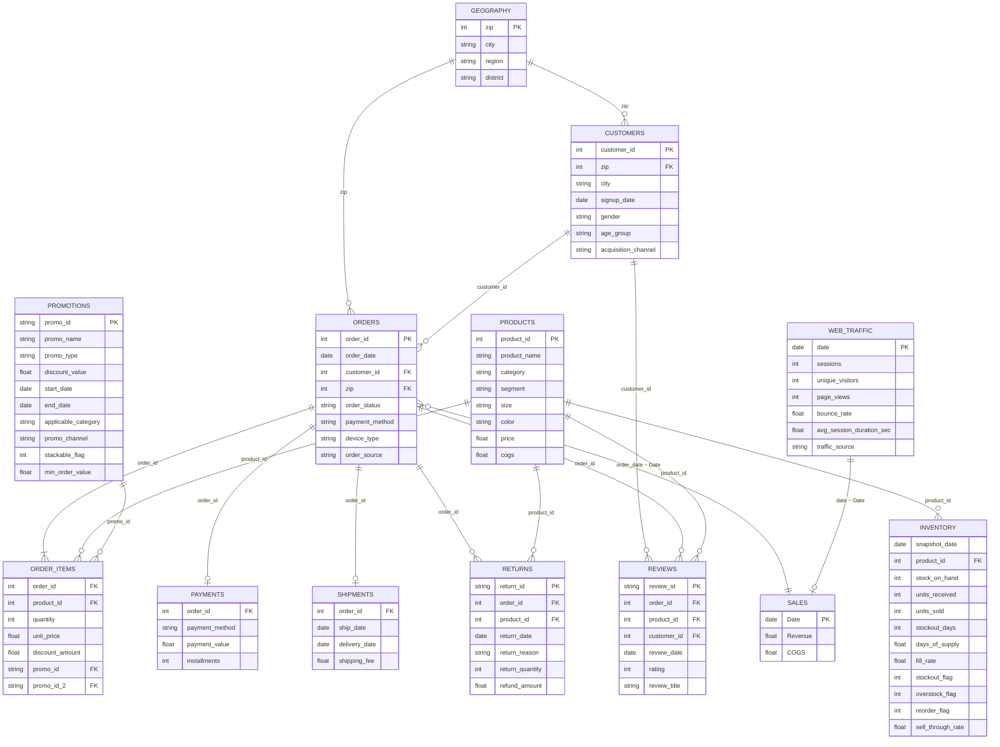

# Sơ đồ ERD — Hệ thống Thương mại điện tử Thời trang

> Dùng cho **Phần 2 — Chương 2.3 (Mô hình dữ liệu)** của báo cáo.
> Sơ đồ Mermaid bên dưới render trực tiếp trên GitHub, VS Code (Markdown Preview Mermaid), hoặc https://mermaid.live

## 1. Sơ đồ quan hệ thực thể (ERD)

## 2. Mô tả quan hệ giữa các bảng

### Nhóm Master (dữ liệu chủ)

| Quan hệ | Loại | Khóa | Ý nghĩa |
|---------|------|------|---------|
| GEOGRAPHY → CUSTOMERS | 1 : N | `zip` | Mỗi khu vực (zip) có nhiều khách hàng |
| GEOGRAPHY → ORDERS | 1 : N | `zip` | Mỗi khu vực có nhiều đơn hàng giao đến |

### Nhóm Transaction (giao dịch)

| Quan hệ | Loại | Khóa | Ý nghĩa |
|---------|------|------|---------|
| CUSTOMERS → ORDERS | 1 : N | `customer_id` | Một khách hàng đặt nhiều đơn |
| ORDERS → ORDER_ITEMS | 1 : N | `order_id` | Một đơn gồm nhiều dòng sản phẩm |
| PRODUCTS → ORDER_ITEMS | 1 : N | `product_id` | Một sản phẩm xuất hiện ở nhiều dòng đơn |
| PROMOTIONS → ORDER_ITEMS | 1 : N | `promo_id`, `promo_id_2` | Một KM áp cho nhiều dòng đơn (có thể stack 2 KM) |
| ORDERS → PAYMENTS | 1 : 1 | `order_id` | Mỗi đơn có một bản ghi thanh toán |
| ORDERS → SHIPMENTS | 1 : 1 | `order_id` | Mỗi đơn có một lần giao hàng |
| ORDERS → RETURNS | 1 : N | `order_id` | Một đơn có thể trả nhiều sản phẩm |
| ORDERS → REVIEWS | 1 : N | `order_id` | Một đơn có thể có nhiều đánh giá |
| PRODUCTS → RETURNS / REVIEWS | 1 : N | `product_id` | Sản phẩm bị trả / được đánh giá nhiều lần |
| CUSTOMERS → REVIEWS | 1 : N | `customer_id` | Một khách viết nhiều đánh giá |

### Nhóm Operational & Analytical

| Quan hệ | Loại | Khóa | Ý nghĩa |
|---------|------|------|---------|
| PRODUCTS → INVENTORY | 1 : N | `product_id` | Mỗi sản phẩm có nhiều bản ghi tồn kho theo tháng (`snapshot_date`) |
| ORDERS → SALES | N : 1 | `order_date` ≈ `Date` | **SALES là bảng tổng hợp doanh thu theo ngày**, được suy ra từ ORDER_ITEMS/ORDERS |
| WEB_TRAFFIC → SALES | 1 : 1 | `date` ≈ `Date` | Lưu lượng web theo ngày, ghép với doanh thu theo ngày |

### Ghi chú quan trọng cho mô hình dự báo

- **`SALES.csv`** (target) là dữ liệu **tổng hợp theo ngày** (`Date`, `Revenue`, `COGS`) — không có khóa ngoại trực tiếp, mà là kết quả roll-up từ các bảng giao dịch.
- **`sample_submission.csv`** có cùng cấu trúc `SALES` — dùng làm khung nộp Kaggle (giai đoạn test 2023→2024).
- Cầu nối để tạo feature: ghép theo **trục thời gian (ngày)** giữa `SALES` ↔ `WEB_TRAFFIC` ↔ `PROMOTIONS` (theo khoảng `start_date`–`end_date`) ↔ `INVENTORY` (theo `snapshot_date`) ↔ tổng hợp `ORDERS`/`RETURNS` theo ngày.

## 3. Phiên bản DBML (cho dbdiagram.io)

> Copy nội dung file [`schema.dbml`](schema.dbml) dán vào https://dbdiagram.io để xuất ảnh ERD chất lượng cao đưa vào báo cáo/slide.
